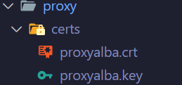
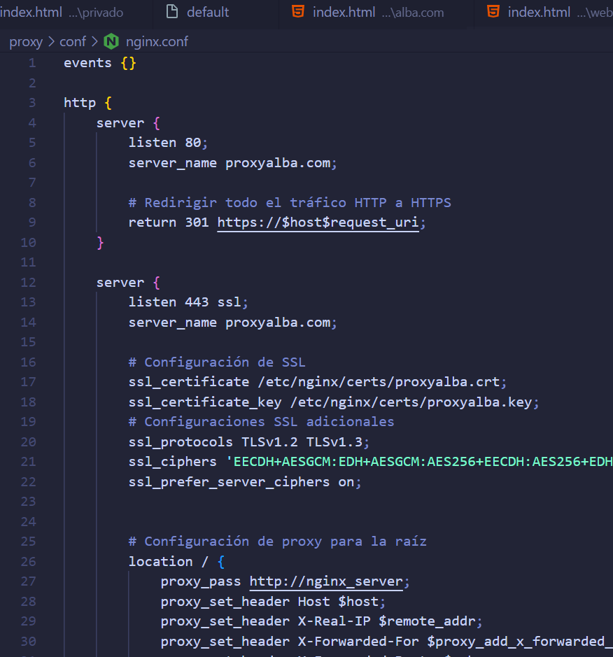
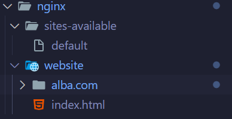
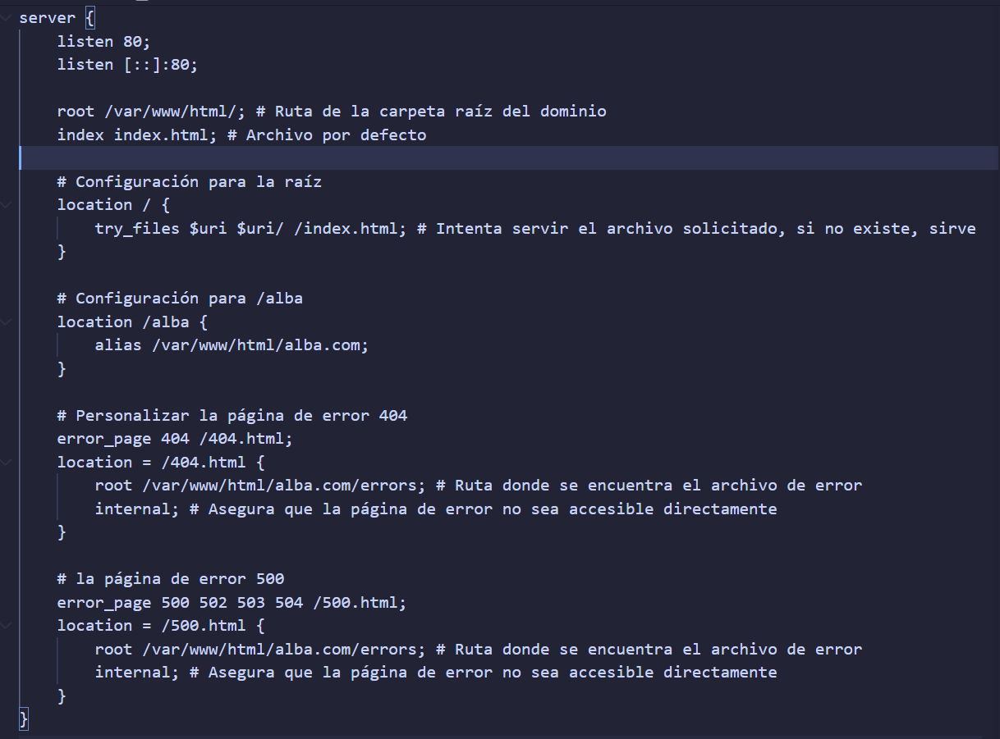
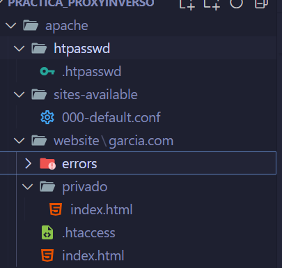
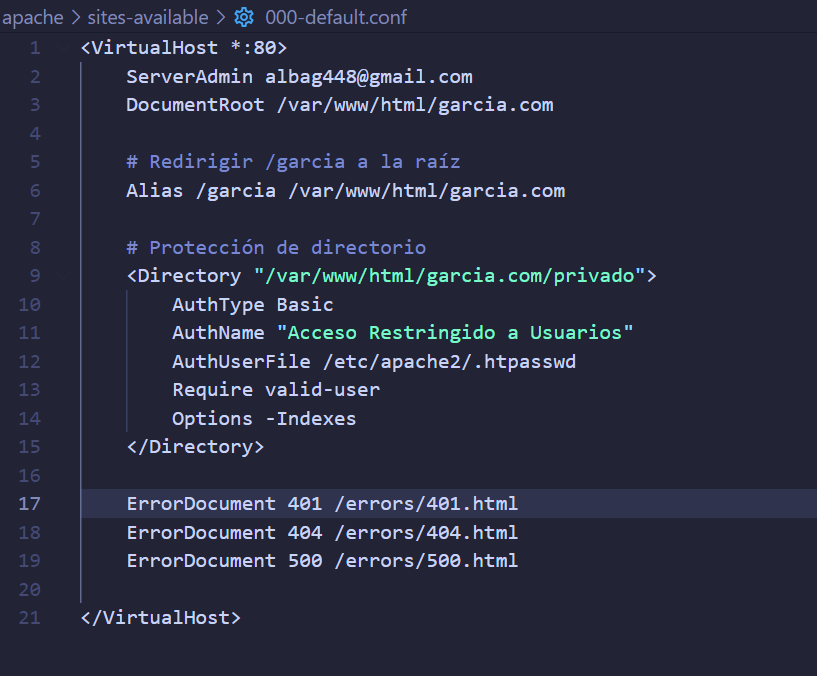
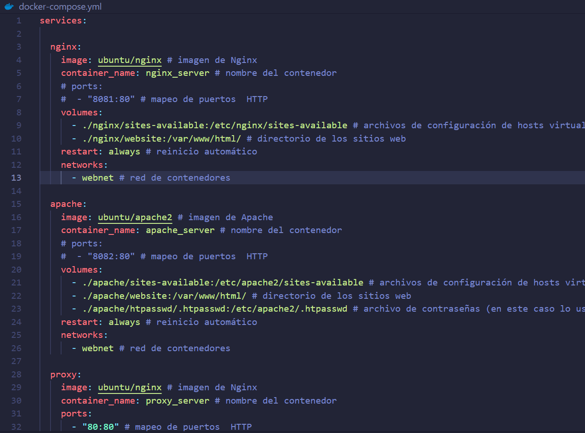
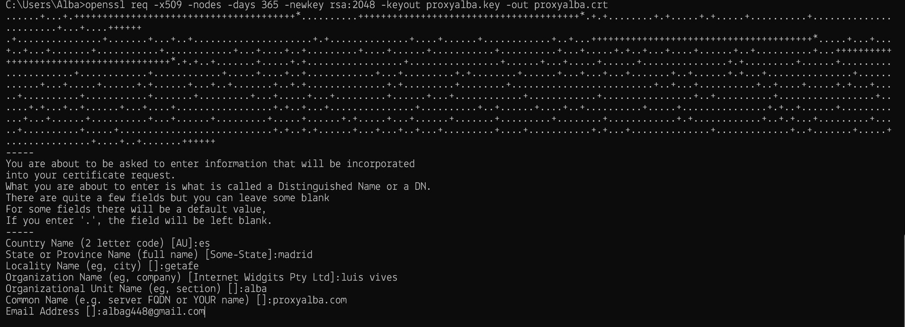
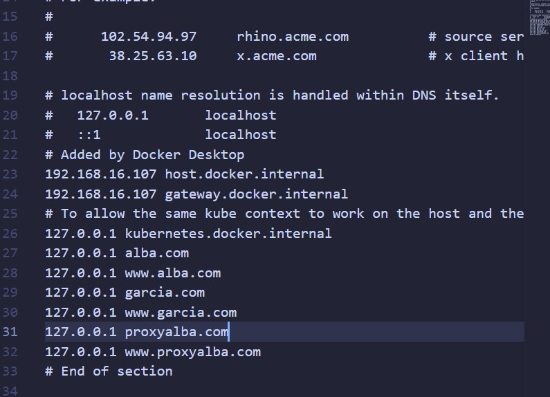
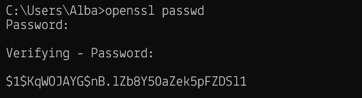

# Practica-ProxyInverso

## Estructura de archivos

- Crear el directorio `proxy`, donde se ubicará la configuración estándar de Nginx y el certificado.



- Crear la carpeta `conf` dentro de `proxy`. En esta carpeta añadimos el archivo `nginx.conf`, que contendrá la siguiente configuración.



- Crear el directorio `certs` dentro de `proxy`. En este, se agregarán posteriormente los archivos del certificado.


- Crear el directorio `nginx`, donde se alojará la configuración del proxy y del sitio web con Nginx.



- Crear el directorio `sites-available` dentro de `nginx` y añadir el archivo `default` con la configuración del proxy, el sitio web en `/nombre` y sus páginas de error.



- Crear el directorio `website` dentro de `nginx` y añadir en su interior los diferentes archivos HTML que compondrán el sitio web en `/nombre`.


- Crear el directorio `apache`, donde se ubicará la configuración del sitio web con Apache.



- Crear el directorio `sites-available` dentro de `apache` y añadir el archivo `000-default.conf` con la configuración del sitio web en `/apellido`, el sitio web en `/privado` dentro de esta y sus páginas de error.



- Crear el directorio `website` dentro de `apache` y añadir en su interior los distintos archivos HTML que compondrán los sitios web en `/apellido` y `/privado`. Además, incluir el archivo `.htaccess` con la configuración de acceso.


 - Crear el directorio `htpasswd` dentro de `apache` y dentro añadir el archivo `.htpasswd`, el cual generaremos más adelante.


- Crear el archivo `docker-compose.yml` con la configuración de nuestro contenedor.




## Generación de certificados

Instalar el programa **OpenSSL**.

Abrir la terminal de OpenSSL y ejecutar el siguiente comando con el nombre de nuestro `server_name` del proxy:

```bash
openssl req -x509 -nodes -days 365 -newkey rsa:2048 -keyout proxynombre.key -out proxynombre.crt
```

Se nos solicitará una serie de datos. Respondemos a las preguntas que se plantean y en el **Common Name** ingresamos el nombre del servidor del proxy, incluyendo la extensión: `proxynombre.com`.



Estos archivos se generarán en la ubicación donde ejecutes el comando. Copia estos archivos en el directorio `certs` del proxy o ejecuta el comando dentro de esta carpeta.

## Modificación del archivo hosts

Modificamos el archivo `hosts` de nuestro PC para crear los DNS de nuestros webhosts.

Accedemos a la ruta: `C:\Windows\System32\drivers\etc`.

Dentro de esta carpeta, encontraremos un archivo `hosts`. Haremos una copia de este como respaldo.

Editamos el archivo `hosts`, añadiendo las IPs y los nombres de nuestros webhosts.



## Lanzamiento del contenedor

Ejecutamos nuestro `docker-compose.yml` en la terminal con el siguiente comando:

```bash
docker-compose –build -d
```

Si encontramos algún error, podemos eliminar lo generado con el siguiente comando:

```bash
docker-compose down
```

Para acceder a la terminal del servidor creado, utilizamos el siguiente comando:

```bash
docker exec -it nginx_server /bin/bash
```

## Generación del archivo .htpasswd

Creamos el archivo `.htpasswd` con el usuario y contraseña que elijamos.

Una vez dentro de la terminal de nuestro servidor Apache, navegamos a la ruta `/etc/apache2`.

Usamos el comando `ls -a` para listar los archivos ocultos y verificar si el archivo `.htpasswd` ya existe. Si no existe, lo generaremos; si ya está presente, lo sobreescribiremos.

Generamos el archivo con el siguiente comando:
```bash
htpasswd -c /etc/apache2/.htpasswd nombre_usuario
```

En `usuario`, introduciremos el nombre del usuario que deseemos, y la contraseña la proporcionaremos cuando nos la solicite.



El archivo se copiará directamente en la ubicación de nuestro proyecto al haber creado el volumen en el `docker-compose.yml`.

## Pruebas en el navegador

Ahora abrimos el navegador y buscamos las siguientes rutas:

- `http://proxyalba.com:80` o `https://proxyalba.com:443`


- Accedemos a `alba.com`


- Accedemos a `garcia.com`


- Accedemos a área privada `garcia.com/privado` ➡️ **Aquí introducimos los credenciales generados con htpasswd**


